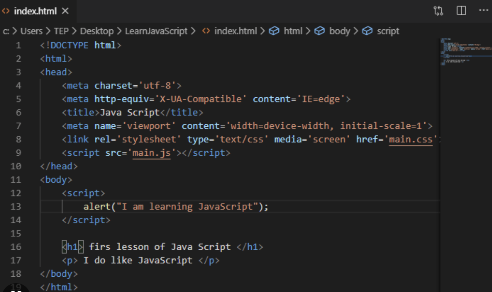
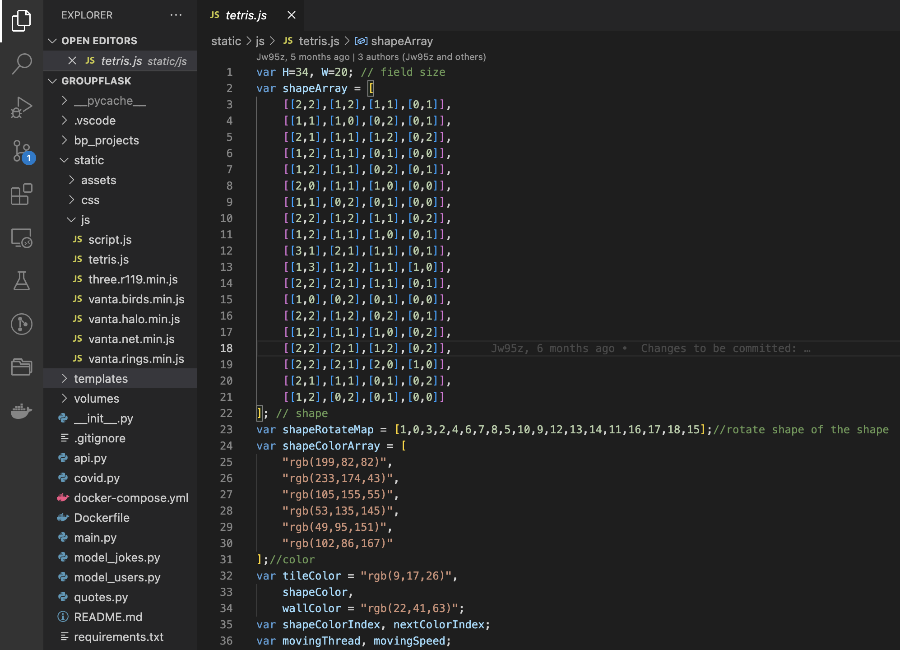
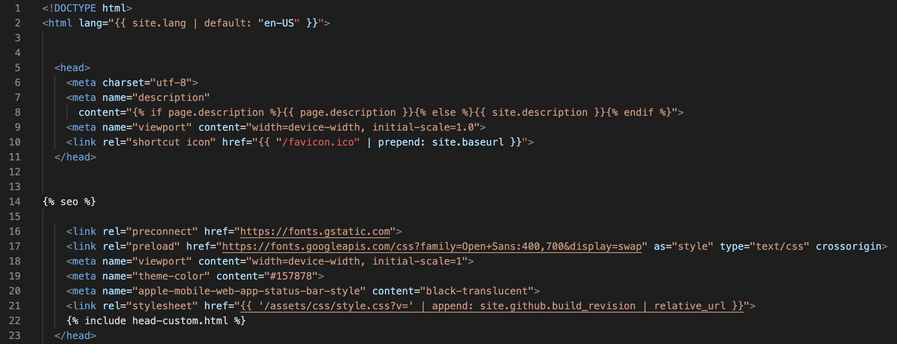

<head>

</head>

<h1>Creating a game using JavaScript</h1>

This is the same idea as what we have always done for our projects.
JavaScript is best for web-based and mobile games because it is generally easy to comprehend. 
- an interpreted scripting language so code does not need to be compiled
- instead, results are interpreted by a user’s command for example clicking and scrolling on the website. JavaScript can use that user input to perform an action accordingly.

<h1>Setting up</h1>

To have a UI (User Interface), you will need to use HTML. We can put our JS file as a script in the html by using script tags or linking a file. Script tags are fine for simple pages, but become confusing if you are doing complicated JS like a large app. 

**It looks like this**

<iframe src="editors/HTMLeditor1.html" width="80%" height="400vh"></iframe>

<h1>Where do you store the JavaScript Code?</h1>

1. You could have a separate JavaScript file full of your JavaScript code. The filename will end in .js

    *Connect the JS file*: To point to your external JavaScript file, or connect the code to your HTML frontend, you could paste this *src Attribute* inside the body of the html. 

    
    - This one is shown in line 38.

    

2. Alternatively, you could write all of your JavaScript code in your HTML page using a *Script container*.

    To refer to the code you can give id's to certain functions and then add the id tag inside of a *div container* or *button container* if the function is a button.

<h1>Where do you store the SASS Code?</h1>

1. Create a .scss file at the same root level as your index.html file, make sure the file name ends in .scss This will be your SASS file.

    *Connect the JS file*: To import the styling that you set up in that file, import a *link container* with "rel=stylesheet" and "href=filename.css". Make sure to close the link tag. 
    
    - This one is shown in line 28.

# JavaScript Functions/code in the Memory Game
1. buttons: The memory cards are buttons which are shown in buttons tags in HTML. It has a onClick attribute for the actual function to work.
2. onclick: occurs when the user clicks on an HTML element, usually a button, and executes the function
3. flipCard: flips over the card the user clicks on 
4. unFlipCard: flips the card over when there is no match
5. disableCard: does not allow other cards to be flipped over when 2 are already flipped and unmatched
5. checkMatch: checks for a match of the two flipped cards
6. resetBoard: resets the board after each two flipped cards so there is a new "first card" and "second card"
7. shuffle: shuffles the cards on the board
3. flipCard: flips card as you check for matches 
4. unFlipCard: unflips when you do not find a match
5. disableCard: does not allow other cards to be flipped if 2 cards are already flipped over
5. checkMatch: checks for a match between the two cards you flipped
6. resetBoard: first card and second card changes after each turn of flipping 2 cards, the board is then reset
7. shuffle: shuffles the places of the cards 

<h1>Creating the Memory Game</h1>
Step 1 - <mark>Create a Repository and open in your code editor</mark>

Step 2 - <mark>Set up index.html defining:</mark>
1. Set the language in html tag
2. Set title with a title tag and link style sheet. This should all be under a head tag.
3. In the head tag add a meta tag to define your metadata. 
4. Under that add a title tag with the title of the game. 
5. Link your style.scss file and then close the head tag. 

Step 3 – <mark>Set up the Board in index.html</mark> Board HTML
1. Set up the body with a section tag inside with class="memory-game"
2. Indented from the section tag create a div tag with class="memory-card"
3. Indented from the div tag add an image tag (img) for each front and back face of each memory card. make sure you have a class defining front or back, src attribute for your image with the correct path. Close off the section tag
4. Add a script tag linking the js file. Close the body and the html tag. 

Step 4 - <mark>Setting up the Board Style</mark> Board CSS
1. .memory-game container
    1. *optional*, Add a border property in the .memory-game container. It helps visualize your cards to set up heights, widths, and more
    2. Add width and height properties with "numberpx;"
    3. Add a display property with "flex;"
    4. Add a flex-wrap property with "wrap;" to correctly lay out the cards in the game board
    5. Add a margin property set to auto in the .memory-game container
2. body container
    1. To center the board in the middle of the page, in a body container add display property with flex. 
    2. Add a height property 
3. .memory-card container
    1. Add a border property with pixel and color details 
    2. Add height and width properties. 
    3. Add a margin property 
    4. Add a position property set to relative
    5. Add a transform property with a scale of 1. This shows a difference when you are choosing a certain card. 
    6. Add a transform-style property set to "preserve-3d" 
    7. Add a transition set to "transform .5s"
    8. Add a box-shadow 
4. .front-face and .back-face container
    1. To align the front and back faces of the card add a position property with value absolute 
    2. Add width and height properties 100%, to take up the whole container 
    3. Add a border-radius property 
    4. Add a background color 
    5. Add a padding 
    6. Add a position set to absolute 
    7. Add a backface-visibility set to hidden
5. .memory-card:active (for the click affect)
    1. Add a transform property with scale of (0.97)
    2. Add a transition property with "transform .2s"
6. .memory-card.flip
    1. add a transform property set to rotateY(180deg)
<pre><code>* {
  padding: 0;
  margin: 0;
  box-sizing: border-box;
}

body {
  height: ___;
  display: flex;
  background: ___;
}

.memory-game {
  width: ___px;
  height: ____px;
  margin: auto;
  display: flex;
  flex-wrap: wrap;
  perspective: ____px;
}

.memory-card {
  width: calc(___% - ___px);
  height: calc(___% - ___px);
  margin: ___px;
  position: relative;
  transform: scale(1);
  transform-style: preserve-3d;
  transition: transform .5s;
  box-shadow: 1px 1px 1px rgba(0,0,0,.3);
}

.memory-card:active {
  transform: scale(0.97);
  transition: transform .2s;
}

.memory-card.flip {
  transform: rotateY(180deg);
}

.front-face,
.back-face {
  width: 100%;
  height: 100%;
  padding: ___px;
  position: absolute;
  border-radius: ___px;
  background: #___;
  backface-visibility: hidden;
}

.front-face {
  transform: rotateY(180deg);
}
</code></pre>

Step 5 - <mark>Functions in JavaScript file</mark>
1. Make a list of all memory card elements, stored in a constant. <pre><code>const cards = document.querySelectorAll('.memory-card');</code></pre>
2. Set these variables 
    - "let hasFlippedCard = false;
    - let lockBoard = false;
    - let firstCard, secondCard;"
3. Loop through the list, and attach an event listener which looks out for a click event. When the event occurs, is clicked, the function will occur. 
4. Here add your flipCard, unflipCard, checkMatch, disableCards, resetBoard, and shuffle functions.
<pre><code>function flipCard() {
  if (lockBoard) return;
  if (this === firstCard) return;

  this.classList.add('flip');

  if (!hasFlippedCard) {
    hasFlippedCard = true;
    firstCard = this;

    return;
  }

  secondCard = this;
  checkForMatch();
}

function checkForMatch() {
  let isMatch = firstCard.dataset.framework === secondCard.dataset.framework;

  isMatch ? disableCards() : unflipCards();
}

function disableCards() {
  firstCard.removeEventListener('click', flipCard);
  secondCard.removeEventListener('click', flipCard);

  resetBoard();
}

function unflipCards() {
  lockBoard = true;

  setTimeout(() => {
    firstCard.classList.remove('flip');
    secondCard.classList.remove('flip');

    resetBoard();
  }, 1500);
}

function resetBoard() {
  [hasFlippedCard, lockBoard] = [false, false];
  [firstCard, secondCard] = [null, null];
}

(function shuffle() {
  cards.forEach(card => {
    let randomPos = Math.floor(Math.random() * 12);
    card.style.order = randomPos;
  });
})();

cards.forEach(card => card.addEventListener('click', flipCard));
</code></pre>

